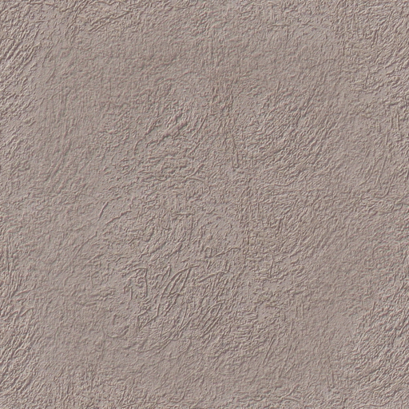
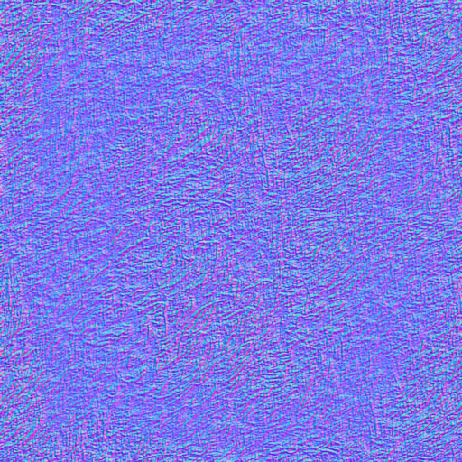

*# dynacam.**
### Overview
---

Dynamic Lights + Camera

Feel that your game needs to expand beyond the default screen limits? Want to add dynamic lighting effects to your game? Want to add split screen to your game? This is the plugin for you.
This plugin adds dynamic lighting and full camera tracking to your game using normal maps and light objects.


+

=


### Notes

- The **quantum.*** engine is responsible for *lightObject* creation
- All *lightObject* creator functions in **quantum.*** are available and reflected on **dynacam.*** as well (You can call *dynacam.newGroup()*, for example)
- All *lightObject* inherit all properties and functions from the conventional *displayObject*, Additional functions and properties are listed below
- All **quantum.*** constructor functions take in the same parameters as the **display.*** library, except for specified parameters listed below (Usually a normal map filename)
- Physics bodies must be added with **dynacam.addBody()**, so lights can be calculated correctly for them
- groups can be inserted into lightGroups, but will not work correctly the other way around.

### Gotchas
- Because objects are drawn to a canvas, and the graphics engine "owns" these objects, touch, tap, and mouse listeners are forwarded using a mirror object hierarchy that sit on front of the canvas. Complex, large objects will make the engine stutter if the hierarchy is too dynamic (Objects deleted, created, moved or scaled constantly).
- All default functions have been replaced with a pointer function, for your own safety do not reference it as it loses its pointed function after referencing it again, even with a different index (translate, scale, rotate, etc.) The engine will warn about unusual behavior.
- Fill and effect userdata have been also replaced by a pointer table, same precautions apply.
- Performance wise, light objects count as 2 display objects, event forwarded objects count as 3, so these can stack up easily, test well for performance!
- Multiple cameras will share the global FPS, so 2 cameras will both work at 30 FPS if Corona is set to 60 FPS, 3 cameras will work at 20 FPS each, and so on. 
- Nil can be used in functions that specify a *baseDir* parameter, *system.ResourceDirectory* will be used.
- The *baseDir* parameter is not optional anymore! use *nil* for default value
- Cameras created with *vertices* will still have their touch area and default view area as a square container, so in some cases these objects will bleed out of a camera edge.

### Functions
---

- dynacam.*
	- dynacam.*newCamera(**options**)* : Returns new *cameraObject*, all keys are optional
		- **options.damping** (number) Number specifying damping. Higher value means slower camera tracking. Default is 10
		- **options.ambientLightColor** (table) 4 Indexed table specifying RGB and intensity respective float values. Default is black *{0, 0, 0, 1}*
		- **options.width** (number) If specified, camera will be of specific width, or width ratio if less than 1. Full screen resize width is the default.
		- **options.height** (number) If specified, camera will be of specific height, or height ratio if less than 1. Full screen resize height is the default.
		- **options.vertices** (table) Table containing normalized (0 - 1 range) vertices for canvas shape. If specified, *.width* and *.height* options will be ignored.
		- **options.cullLimit** (number) Cull limit in pixel value. Lights with a position outside any edge plus/minus this number will not be rendered. default is 800. Think of it as a safe border where lights will still be rendered.
	- dynacam.*refresh()*
		- Refresh internal display values in case of a viewport dimensions change, updates fullscreen dimensions on all cameras
	- dynacam.*newLight(**options**)* : Creates and tracks new light
        - **options.color** (table) Table containing normalized RGB and intensity values
		- **options.attenuationFactors** (table) Table containing *constant*, *linear* and *quadratic* light attenuation factors
		- **options.z** (number) Light height (0 - 1 range)
	- dynacam.*addBody(**object**, **...**)*
        - Create and track physics body. Uses same parameters as *physics.addBody()*. Used to update physics body normal rotation correctly. Lights will not work on a physics body correctly unless tracked by dynacam.
	- dynacam.*start()*
        - Starts updating all cameras
    - dynacam.*stop()*
        - Stops updating all cameras
- *cameraObject*
    - cameraObject:*add(**object**, **normal**, **back**)*
        - Add specified *object* to camera hierarchy. Think of it like an *:insert()* replacement. **options** can be the following:
            - **options.normal** (bool) Adds object to normal view
            - **options.back** (bool) Adds object to default back view
	**isFocus** (boolean) will make the camera track this object. **normal** (boolean) can be specified to insert object to normal view. Works with default and light objects
    - cameraObject:*getZoom()*
        - Returns zoom value. Default is 1
    - cameraObject:*setZoom(**zoom**, **zoomDelay**, **zoomTime**, **onComplete**)*
        - Sets camera **zoom** (number), as a scale number
        - **zoomDelay** (number) delay in milliseconds before zoom begins or sets, set to 0 for instant
        - **zoomTime** (number) time in milliseconds for zoom to get to specified value, set to 0 for instant
        - **onComplete** Optional function called when zoom animation completes.
    - cameraObject:*setBounds(**minX**, **maxX**, **minY**, **maxY**)*
        - Sets camera boundaries
    - cameraObject:*setFocus(**object**, **options**)*
        - Will track and follow **object** in camera center. dynacam.*start()* has to be called for any tracking to occur.
        - **options.soft** (bool) If *false*, focus will be immediate
        - **options.trackRotation** (bool) If *true*, will track object rotation
    - cameraObject:*removeFocus()*
        - Removes any object from focus
    - cameraObject:*toPoint(**x**, **y**, **options**)*
        - Sets focus on the specified **x** and **y** coordinates. **options** are the same as *cameraObject:setFocus()*
    - cameraObject:*setDrawMode(**value**)*
        - **value** (string/bool) Can be set to one of the following:
            - *true* to view lights as small dots
            - *"diffuse"* to view diffuse frameBuffer
            - *"normal"* to view normal frameBuffer
            - *"listeners"* to view touch forward areas.
            - *"light"* to view lightBuffer
    - cameraObject:*addListenerObject(**object**)*
        - Internal function used to forward touch, tap and mouse events to objects owned by the camera canvas. This is done automatically and internally by all *lightObject*
- quantum.*
	- quantum.*newGroup()*
	- quantum.*newLine(**...**)*
	- quantum.*newCircle(**x**, **y**, **radius**)*
	- quantum.*newRect(**x**, **y**, **width**, **height**)*
	- quantum.*newRoundedRect(**x**, **y**, **width**, **height**, **cornerRadius**)*
	- quantum.*newImage(**filename**, **normalFilename**, **baseDir**)*
		- **normalFilename** (string) Normal map filename
	- quantum.*newContainer(**width**, **height**)*
	- quantum.*newImageRect(**filename**, **normalFilename**, **baseDir**, **width**, **height**)*
		- **normalFilename** (string) Normal map filename
	- quantum.*newPolygon(**x**, **y**, **vertices**)*
	- quantum.*newMesh(**options**)*
	- quantum.*newText(**options**)*
		- **options.normal** (table) Table containing normal vector values, RGB + Intensity
	- quantum.*newSprite(**diffuseSheet**, **normalSheet**, **sequenceData**)*
		- **normalSheet** (table) same as diffuseSheet, but using normal map filename instead.
	- quantum.*newSnapshot(**width**, **height**)*

### Properties
---

- *lightObject*
    - lightObject.*normal* (paint) : Supports any paint like *lightObject.fill*, but is intended for normal maps. A normal map rotation fix effect is placed by default, if removed, normal maps will stop illuminating correctly if rotated!
	- lightObject.*super* (table) : Table to call default display object functions that only affect the diffuse part of the object. for example: `lightObject.super:setFillColor(1)`
- *cameraObject*
    - cameraObject.values.*targetRotation* (number) : Use this value to manually rotate the internal camera view.

### Examples
---
Set up a new camera, add objects, add lights, & track an object
````lua
local dynacam = require("dynacam") -- Require plugin
local camera = dynacam.newCamera() -- Create a new camera and position it
camera.x = display.contentCenterX
camera.y = display.contentCenterY

local background = dynacam.newGroup() -- Add a background layer
camera:add(background) -- Add BG

local bgCircle = dynacam.newCircle(0, 50) -- BG circle
background:insert(bgCircle)

local foreground = dynacam.newGroup() -- Add a foreground layer
camera:add(foreground) -- Add FG

local light = dynacam.newLight() -- Create a new light
foreground:insert(light)

local fgRect = dynacam.newRect(0, 0, 100, 100) -- FG rect
background:insert(fgRect)

dynacam.start() -- Start plugin

camera:setFocus(fgRect) -- Set focus on rect, placing it on center of camera.
transition.to(fgRect, {delay = 1000, time = 5000, x = 5000}) -- Camera should follow rect, leaving circle behind
````
Texturing a rect
````lua
local rect = dynacam.newRect(0, 0, 500, 500)
rect.fill = {type = "image", filename = "diffuse.png"}
rect.normal = {type = "image", filename = "normal.png"}
````


---
Copyright (c) 2019, Basilio Germán
All rights reserved.